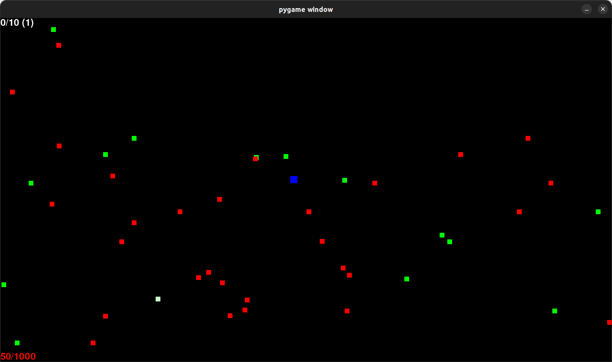

## Квадратики
---
  

---

Игра с квадратиками (на текстуры не хватило) которые стреляют друг в друга  
Game with squares (no textures cuz lazy) that shoot eachother

### Запуск \ Start
Первый запуск \ First start
```
pip install pipx  
pipx install poetry  
poetry install  
poetry shell  
python main.py
```
Запуск с установленными зависимостяи \ Start with dependencied installed
```
poetry shell
python main.py
```
### Управление \ Controls

Вы играете за серый квадрат. Управление на стрелочки. Стрельба на Z. Ваши пули синие, вражеские красные. Враги зеленого цвета. Ваш уровень вверху экрана. Ваши жизни внизу.  
  
You play as gray square. Move with arrows. Fire with Z. Your bullets blue, enemy's red. Enemies are green. Your level in the top corner. Your hp in the bottom. 

